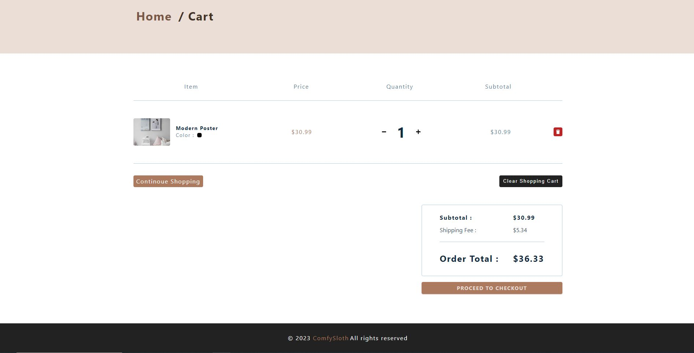

# Comfy-Sloth

## Table of contents

- [Overview](#overview)
  - [Review](#Review)
  - [Screenshots](#screenshots)
  - [Link](#link)
  - [Built with](#built-with)
- [Author](#author)

## Overview

### Review

Here is my ECommerce React Project - Comfy Sloth Store. You can create an account, select a product, filter it, add it to the cart, start the buying process and then buy.

### Screenshots

### Link

- Solution URL: [GitHub](https://github.com/nikamerebashvili95/jobster)

### Built with

- React
- API
- Hooks
- Reducer
- Router
- Auth0

## Author

- GitHub - [Nika Merebashvili](https://github.com/nikamerebashvili95)
- LinkedIn - [Nika Merebashvili](https://www.linkedin.com/in/nikamerebashvili)
- Portfolio - [Portfolio](https://nikamerebashvili95.github.io/portfolio-website/)

